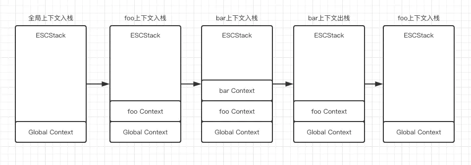

# 执行上下文EC 
执行上下文EC，包含了代码运行所需要的 变量 函数 查找变量需要的作用域链（scope chain）以及this指向 （this binding）

执行上下文EC一般分以下几类

1. 全局执行上下文
2. 函数执行上下文
3. eval执行上下文 （少用）

> 注意，执行上下文是一个C++对象，在Javascript无法直接访问，只能访问一些被暴露出来的部分，如window对象

# 执行上下文堆栈 ECS 
执行上下文堆栈中包含执行上下文，注意其保存的是执行上下文对象的地址，而并非整个执行上下文对象都放到堆栈里！

当代码开始执行前，预解析阶段，会先将全局执行上下文GEC放到ECS中，这也是我们为什么可以直接使用window对象获取一些浏览器内置的方法属性

当遇到函数执行时，会在预解析阶段先生成函数的执行上下文，并且压入执行上下文堆栈，当函数内再遇到函数执行时，继续压入，直到函数执行接受，弹出对应函数的执行上下文！

> 需要注意
>
> 1.执行上下文堆栈顶部永远是当前正在执行代码的执行上下文
>
> 2.如果存在闭包，则弹出的执行上下文对象还存在引用，不会被立刻垃圾回收

例子:
```javascript
function foo () { 
    function bar () {        
      return 'bar';
    }
    return bar();
}
foo();
```
此代码执行过程中ECS的变化如下图:

