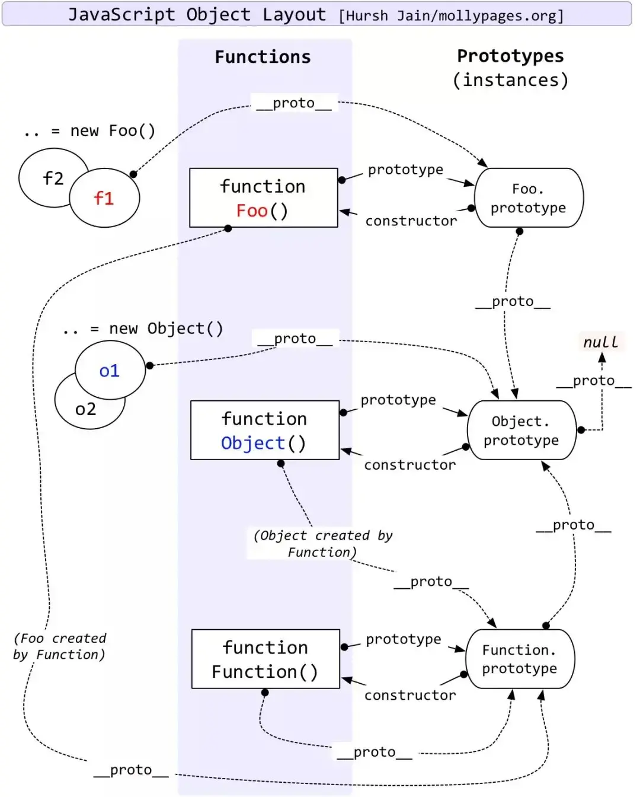

# 原型&原型链
### 需求（目的）： 为什么需要原型链机制
Jacascript是基于对象的，无法实现面向对象语言一样的继承，多态等操作，所以引入原型链来实现这些功能。

> 基于对象&面向对象
> 
> 基于对象是只可以使用对象，语言内部用对象封装了一些对象可以提供开发者使用的功能，但是开发者无法通过类似于类的模板创建对象，也就无法实现类的继承，多态等功能。
Javascript就是基于对象的，Java是面向对象的

### 原型链
- 任何函数都有一个原型对象，其prototype属性指向该对象
- 任何对象都有原型，其[[prototype]]指向其原型（__proto__）
- 任何对象的原型都是构造该对象函数的原型对象

### 内置对象
注意，Object.prototype Function.prototype Object Function是内置对象，不存在谁创造谁一说，是浏览器加入到环境中的。其中：
- Function.__proto__ = Function.prototype
- Object.__proto__ = Function.prototype
- Function.prototype.__proto__ = Object.prototype
- Object.prototype.__proto__ = null

### 原型链图
