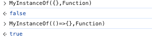

### 原型链相关方法
 - instanceOf 判断是否是实例，本质上是递归判断obj.__proto__ 是否等于构造函数.prototype

```javascript

function MyInstanceOf(instance,constructor){
    if(!instance){
        return false
    }
    if(Object.getPrototypeOf(instance) === constructor.prototype){
        return true
    }else{
        return MyInstanceOf(Object.getPrototypeOf(instance),constructor)
    }
}

```


 - getPrototypeOf() 获取原型对象
 - setPrototypeOf() 设置原型对象

 - Object.create(对象obj) 创建一个对象，并且以对象obj为原型